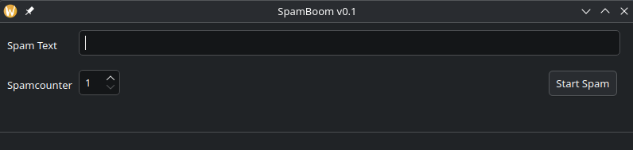

# SpamBoom v0.1

A simple PyQt5 application that automatically pastes the text you enter the specified number of times and presses Enter.  
User-friendly interface makes starting the spam process easy.

---

## Application Screenshot



---

## Features
- Copies the entered text to the clipboard and repeats the paste operation.
- Allows setting the number of spam repetitions via SpinBox.
- Warns if the input text box is empty.
- Provides a 5-second delay to prepare before starting.

---

## How to Run

```bash
git clone https://github.com/FurkanKokcu/Bruh-Force-Drug-Assistant.git
pip install -r requirements.txt
python main.py
